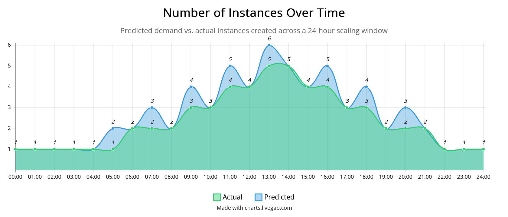

# Nexcast

Nexcast is a autoscaler that forecasts demand and turns that forecast into replica recommendations. It can operate with either Docker or Kubernetes. Traffic demand is calculated from per-service traffic metrics plus capacity settings defined in `services.yaml`.

Nexcast supports two backends:

- `docker` for scaling locally-managed Docker containers
- `kubernetes` for scaling existing Kubernetes Deployments

$$
\text{Cores}_{\text{total}} = \frac{\beta \cdot \text{RPS}_{\text{target}}}{\text{utilization}_{\text{target}} - a}
$$

$$
\text{Instances} = \left\lceil \frac{\text{Cores}_{\text{total}}}{\text{cores}_{\text{instance}}} \right\rceil
$$

- `beta` is the service's CPU cost per request rate unit; higher `beta` means each extra unit of traffic consumes more CPU.
- `a` is a fixed utilization offset that accounts for baseline overhead or inefficiency before useful traffic work is done.
- `utilization_target` is the desired safe operating utilization for the service, usually kept below 1.0 to leave headroom.
- `cores_instance` is the effective CPU capacity one replica can contribute.

`beta` and `a` should ideally come from load testing or production observations for each service. If they are estimated poorly, traffic-based scaling will become noisy and less reliable.

</img>

## Table of Contents
- [Nexcast](#nexcast)
  - [Table of Contents](#table-of-contents)
  - [Setup](#setup)
    - [Update deployed instances](#update-deployed-instances)
    - [Single instance](#single-instance)
  - [Example Workload](#example-workload)
    - [Docker Example](#docker-example)
    - [Kubernetes Example](#kubernetes-example)
  - [Docker and Kubernetes config](#docker-and-kubernetes-config)
    - [Docker](#docker)
    - [Kubernetes](#kubernetes)

## Setup

Make sure Go is installed, then fetch dependencies and verify the project builds:

```bash
go mod download
go build .
```

Run it locally with:

```bash
go run .
```

Nexcast loads `.env` automatically if present.

Run it as a service with:
```bash
sudo cp nexcast.service /etc/systemd/system/
sudo mkdir -p /etc/nexcast
sudo cp .env /etc/nexcast/nexcast.env
sudo systemctl daemon-reload
sudo systemctl enable --now nexcast
```

What the autoscaler does:

- Loads runtime configuration and the shared `services.yaml` inventory
- Starts an HTTP API (`/nodeInfo`, `/servicesState`, `/history`) for the dashboard
- Collects local service state
- Posts one observation per service per reconcile cycle to the observation collector (optional)
- Calculates replica recommendations locally from current traffic and service capacity settings
- Applies replica changes through the selected backend
- Persists a rolling history snapshot for the dashboard charts

If a service exposes traffic metrics and includes capacity coefficients in `services.yaml`, Nexcast scrapes current RPS and converts that demand into replica recommendations locally.

### Update deployed instances

```bash
kubectl apply -f nextcast.yaml
kubectl rollout restart deployment/nextcast -n default
kubectl rollout status deployment/nextcast -n default
kubectl get pods -n default -l app=nextcast -o wide
```

### Single instance

```bash
kubectl apply -f nextcast.yaml
kubectl get deploy,pods -n default -l app=nextcast -o wide
```

## Example Workload

### Docker Example

Build the sample app image:

```bash
docker build -t example-server:latest ./example/docker
```

### Kubernetes Example

Build the example image, then apply the manifests from `example/kubernetes/`:

```bash
docker build -t example-server:latest ./example/docker
kubectl apply -f example/kubernetes/kubernetes.yaml
```

## Docker and Kubernetes config

### Docker

Create a shared service inventory in `services.yaml` on every node:

```yaml
services:
  - name: api
    system_id: 0
    image_name: example-server:latest
    container_prefix: nextcast-api
    port_base: 18080
    metrics_path: /metrics
    min_replicas: 1
    max_replicas: 10
    target_per_node: 65.0
    scale_up_step: 2
    scale_down_step: 1
    beta: 0.02
    utilization_target: 0.75
    a: 0.10
    cores_instance: 0.50
```

Example:

```bash
BACKEND=docker
LISTEN_ADDR=:8081
SERVICES_FILE=services.yaml
CHECK_INTERVAL=20s
COOLDOWN=60s
OBSERVATION_URL=http://localhost:8000/observations
```

### Kubernetes

Create a Kubernetes inventory in `services.yaml` on every Nexcast peer:

```yaml
services:
  - name: api
    system_id: 0
    namespace: default
    deployment_name: nextcast-example
    min_replicas: 1
    max_replicas: 10
    target_per_node: 65.0
    scale_up_step: 2
    scale_down_step: 1
```

```bash
BACKEND=kubernetes
LISTEN_ADDR=:8081
SERVICES_FILE=/etc/nexcast/services.yaml
K8S_NAMESPACE=default
METRICS_FALLBACK_POLICY=scale-up-only
CHECK_INTERVAL=20s
COOLDOWN=60s
OBSERVATION_URL=http://predictor.default.svc.cluster.local:8000/observations
```

Metrics behavior:

- If the Metrics API is available, Nexcast computes CPU and memory utilization from pod usage versus pod resource requests
- If metrics are unavailable, Nexcast falls back to replica-count-only mode and, by default, only allows scale-up decisions while holding steady on scale-down recommendations

Training data behavior:

- Nexcast emits one observation per service on every reconcile cycle, even when no scale action is applied
- Observations can be forwarded to any external collector that accepts the JSON payload

The Kubernetes backend uses the in-cluster API by default. Override the connection with these environment variables when needed:

- `K8S_API_SERVER`
- `K8S_BEARER_TOKEN` or `K8S_TOKEN_FILE`
- `K8S_CA_FILE`
- `K8S_INSECURE_SKIP_TLS_VERIFY=true`

Traffic metrics behavior:

- Docker mode scrapes each managed container via its mapped host port and `metrics_path`
- Kubernetes mode scrapes each pod via `podIP:metrics_port + metrics_path`
- the built-in example app exposes `GET /metrics` with a rolling `rps` field
- Nexcast uses recent observed `rps` samples to smooth demand before sizing replicas