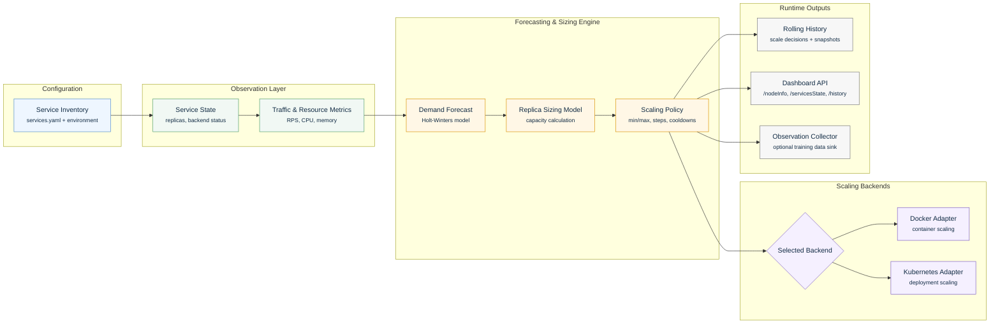
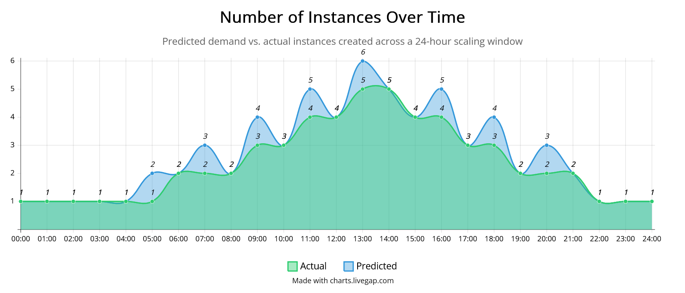

<div align="center">

# Nexcast
<br />


<br />

**Forecast-driven autoscaling for Docker and Kubernetes workloads.**

Nexcast predicts near-term service demand and turns that forecast into safe replica recommendations using traffic forecasting, capacity modelling, cooldown-aware decisions, and backend-specific scaling adapters.

**Forecast demand. Calculate capacity. Scale safely.**

</div>

## Overview

Nexcast is a forecast-driven autoscaler that predicts near-term service demand and converts it into replica recommendations for Docker or Kubernetes workloads.

It is designed to explore cloud-native autoscaling ideas such as:

* traffic-based demand forecasting
* service capacity modelling
* cooldown-aware scale decisions
* Docker and Kubernetes backend adapters
* metrics fallback behaviour
* HTTP APIs for dashboards and collectors

## Table of Contents

- [Nexcast](#nexcast)
  - [Overview](#overview)
  - [Table of Contents](#table-of-contents)
  - [Overview](#overview-1)
  - [How It Works](#how-it-works)
  - [Architecture](#architecture)
  - [Replica Sizing Model](#replica-sizing-model)
  - [Requirements](#requirements)
  - [Setup](#setup)
    - [Run as a systemd service](#run-as-a-systemd-service)
  - [Configuration](#configuration)
  - [Service Inventory](#service-inventory)
    - [Docker inventory](#docker-inventory)
    - [Kubernetes inventory](#kubernetes-inventory)
  - [Running with Docker](#running-with-docker)
  - [Running with Kubernetes](#running-with-kubernetes)
  - [HTTP API](#http-api)
    - [Example service state response](#example-service-state-response)
  - [Observations and Training Data](#observations-and-training-data)
  - [Testing](#testing)
  - [Troubleshooting](#troubleshooting)
    - [Service does not scale](#service-does-not-scale)
    - [Kubernetes metrics are missing](#kubernetes-metrics-are-missing)
    - [Kubernetes deployment not found](#kubernetes-deployment-not-found)
    - [Docker metrics are missing](#docker-metrics-are-missing)
    - [History looks empty after restart](#history-looks-empty-after-restart)
  - [Limitations](#limitations)
  - [Roadmap](#roadmap)
  - [License](#license)

## Overview

Nexcast reads service definitions from `services.yaml`, collects traffic and runtime state, forecasts near-term request demand, calculates a safe replica count, and applies scale decisions through the selected backend.

Supported backends:

| Backend | Purpose |
|---|---|
| `docker` | Scale locally managed Docker containers |
| `kubernetes` | Scale existing Kubernetes Deployments |

Nexcast also exposes JSON endpoints that can be used by dashboards, collectors, or other tools to inspect node state, service state, and rolling scaling history.

## How It Works

Each reconcile cycle follows this flow:


```mermaid
flowchart LR
    %% Inputs
    subgraph Input["Configuration"]
        Config["Service Inventory<br/><small>services.yaml + environment</small>"]
    end

    %% Runtime observation
    subgraph Observe["Observation Layer"]
        State["Service State<br/><small>replicas, backend status</small>"]
        Metrics["Traffic & Resource Metrics<br/><small>RPS, CPU, memory</small>"]
    end

    %% Forecasting and sizing
    subgraph Engine["Forecasting & Sizing Engine"]
        Forecast["Demand Forecast<br/><small>Holt-Winters model</small>"]
        Sizing["Replica Sizing Model<br/><small>capacity calculation</small>"]
        Policy["Scaling Policy<br/><small>min/max, steps, cooldowns</small>"]
    end

    %% Execution backends
    subgraph Backends["Scaling Backends"]
        Backend{"Selected Backend"}
        Docker["Docker Adapter<br/><small>container scaling</small>"]
        Kubernetes["Kubernetes Adapter<br/><small>deployment scaling</small>"]
    end

    %% Outputs
    subgraph Outputs["Runtime Outputs"]
        History["Rolling History<br/><small>scale decisions + snapshots</small>"]
        API["Dashboard API<br/><small>/nodeInfo, /servicesState, /history</small>"]
        Collector["Observation Collector<br/><small>optional training data sink</small>"]
    end

    Config --> State
    State --> Metrics
    Metrics --> Forecast
    Forecast --> Sizing
    Sizing --> Policy
    Policy --> Backend

    Backend --> Docker
    Backend --> Kubernetes

    Policy --> History
    Policy --> API
    Policy --> Collector

    classDef config fill:#eef6ff,stroke:#4f8cc9,stroke-width:1px,color:#102a43;
    classDef observe fill:#f1f8f4,stroke:#4f9d69,stroke-width:1px,color:#102a43;
    classDef engine fill:#fff7e6,stroke:#d99000,stroke-width:1px,color:#102a43;
    classDef backend fill:#f5f0ff,stroke:#7c5cc4,stroke-width:1px,color:#102a43;
    classDef output fill:#f7f7f7,stroke:#777,stroke-width:1px,color:#102a43;

    class Config config;
    class State,Metrics observe;
    class Forecast,Sizing,Policy engine;
    class Backend,Docker,Kubernetes backend;
    class History,API,Collector output;
```

At a high level, Nexcast:

1. loads environment configuration and the shared service inventory
2. collects current service and backend state
3. forecasts near-term traffic demand
4. converts demand into replica recommendations
5. applies cooldown, min/max, and step constraints
6. scales through Docker or Kubernetes
7. records observations and rolling history

## Architecture

| Path | Purpose |
|---|---|
| `main.go` | Entrypoint, config loading, backend startup |
| `src/core/` | Forecasting, replica calculation, reconcile loop |
| `src/api/server.go` | HTTP API for `/nodeInfo`, `/servicesState`, and `/history` |
| `history/` | Binary gob history snapshots with a rolling window |
| `charts/nexcast/` | Helm chart for Kubernetes deployment |
| `Tensorflow/` | Optional TensorFlow/FastAPI prediction components |
| `v2/` | Standalone Python Holt-Winters implementation and validation scripts |

## Replica Sizing Model

Nexcast forecasts near-term demand using a Holt-Winters model with level, trend, and seasonal components. The forecast produces a near-term request-rate estimate, and the highest predicted value over the forecast horizon is used as the target demand:

$$
RPS_{target} = \max(\hat{RPS}_{t+1}, \hat{RPS}_{t+2}, \ldots, \hat{RPS}_{t+h})
$$

Replica sizing then estimates the total CPU capacity required to serve that demand:

$$
Cores_{total} = \frac{\beta \times RPS_{target}}{utilization_{target} - a}
$$

The required replica count is then calculated as:

$$
Instances = \left\lceil \frac{Cores_{total}}{cores_{instance}} \right\rceil
$$

Where:

| Parameter | Meaning |
|---|---|
| `RPS_target` | Peak forecast request rate over the near-term horizon |
| `beta` | CPU cost per unit of request traffic |
| `a` | Baseline utilization offset or overhead |
| `utilization_target` | Desired safe operating utilization below saturation |
| `cores_instance` | Effective CPU capacity of one replica |

If `beta`, `utilization_target`, and `cores_instance` are all greater than zero, Nexcast uses the CPU-based sizing model. Otherwise it falls back to the simpler traffic-based model:

$$
replicas = \left\lceil \frac{RPS}{target_{per\_node}} \right\rceil
$$

The final recommendation is then constrained by the configured minimum replicas, maximum replicas, scale-up step, scale-down step, and cooldown window.

<p align="center">
  
</p>

`beta` and `a` should ideally come from load testing or production observations. Poor estimates can make traffic-based autoscaling noisy or inaccurate.

## Requirements

- Go 1.26.1 or compatible version from `go.mod`
- Docker for Docker backend
- Kubernetes cluster access for Kubernetes backend
- Metrics endpoint on each service if traffic-based scaling is required
- Optional Helm for chart deployment
- Optional external collector for observation ingestion

## Setup

Fetch dependencies and verify the project builds:

```bash
go mod download
go build .
```

Run locally:

```bash
go run .
```

Nexcast loads `.env` automatically when present and falls back to `example.env`.

### Run as a systemd service

```bash
sudo cp nexcast.service /etc/systemd/system/
sudo mkdir -p /etc/nexcast
sudo cp .env /etc/nexcast/nexcast.env
sudo systemctl daemon-reload
sudo systemctl enable --now nexcast
sudo systemctl status nexcast
```

## Configuration

All runtime configuration is provided through environment variables.

| Variable | Default | Description |
|---|---:|---|
| `BACKEND` | required | `docker` or `kubernetes` |
| `LISTEN_ADDR` | `:8081` | HTTP API listen address |
| `SERVICES_FILE` | `services.yaml` | Path to service inventory |
| `CHECK_INTERVAL` | `20s` | Reconcile-loop interval |
| `COOLDOWN` | `60s` | Minimum delay between scale actions |
| `HW_ALPHA` | `0.3` | Holt-Winters level smoothing |
| `HW_BETA` | `0.1` | Holt-Winters trend smoothing |
| `HW_GAMMA` | `0.1` | Holt-Winters seasonal smoothing |
| `HW_DELTA` | `0.05` | Additional model parameter used by the forecast implementation |
| `HW_HORIZON` | `6` | Forecast horizon |
| `OBSERVATION_URL` | empty | Optional collector URL for observations |
| `K8S_NAMESPACE` | `default` | Default Kubernetes namespace |
| `METRICS_FALLBACK_POLICY` | `scale-up-only` | Behaviour when metrics are unavailable |

Example `.env` for Docker:

```bash
BACKEND=docker
LISTEN_ADDR=:8081
SERVICES_FILE=services.yaml
CHECK_INTERVAL=20s
COOLDOWN=60s
OBSERVATION_URL=http://localhost:8000/observations
```

Example `.env` for Kubernetes:

```bash
BACKEND=kubernetes
LISTEN_ADDR=:8081
SERVICES_FILE=/etc/nexcast/services.yaml
K8S_NAMESPACE=default
METRICS_FALLBACK_POLICY=scale-up-only
CHECK_INTERVAL=20s
COOLDOWN=60s
OBSERVATION_URL=http://predictor.default.svc.cluster.local:8000/observations
```

## Service Inventory

The `services.yaml` schema differs by backend.

### Docker inventory

```yaml
services:
  - name: nginx
    system_id: 0
    image_name: nginx:1.27
    container_prefix: nexcast-nginx
    port_base: 18080
    metrics_path: /metrics
    min_replicas: 1
    max_replicas: 10
    target_per_node: 65.0
    scale_up_step: 2
    scale_down_step: 1
    beta: 0.02
    utilization_target: 0.75
    a: 0.10
    cores_instance: 0.50
```

### Kubernetes inventory

```yaml
services:
  - name: redis
    system_id: 0
    namespace: default
    deployment_name: redis
    min_replicas: 1
    max_replicas: 10
    target_per_node: 65.0
    scale_up_step: 2
    scale_down_step: 1
    metrics_port: 8080
    metrics_path: /metrics
```

Kubernetes mode requires `deployment_name`. `namespace` defaults to `K8S_NAMESPACE` if omitted.

## Running with Docker

Create `services.yaml` using the Docker inventory shape, then run:

```bash
BACKEND=docker SERVICES_FILE=services.yaml go run .
```

Nexcast will:

- discover local service state
- scrape each managed container through its mapped host port and `metrics_path`
- calculate replica recommendations
- apply Docker scaling actions
- expose state through the HTTP API

## Running with Kubernetes

Deploy Nexcast directly:

```bash
kubectl apply -f nextcast.yaml
kubectl rollout status deployment/nextcast -n default
kubectl get pods -n default -l app=nextcast -o wide
```

Or install with Helm:

```bash
helm upgrade --install nexcast ./charts/nexcast -n nexcast \
  --create-namespace \
  --set-file services.yaml=services.yaml
```

The Kubernetes backend uses the in-cluster API by default. Override it when needed:

| Variable | Purpose |
|---|---|
| `K8S_API_SERVER` | Explicit API server URL |
| `K8S_BEARER_TOKEN` | Bearer token value |
| `K8S_TOKEN_FILE` | Path to token file |
| `K8S_CA_FILE` | CA certificate file |
| `K8S_INSECURE_SKIP_TLS_VERIFY=true` | Disable TLS verification for testing |

## HTTP API

Nexcast exposes JSON endpoints for dashboards and automation.

| Method | Endpoint | Purpose |
|---|---|---|
| `GET` | `/nodeInfo` | Node or runtime state |
| `GET` | `/servicesState` | Current service state and recommendations |
| `GET` | `/history` | Rolling history snapshots for charts and analysis |

Example:

```bash
curl http://localhost:8081/nodeInfo
curl http://localhost:8081/servicesState
curl http://localhost:8081/history
```

### Example service state response

```json
{
  "services": [
    {
      "name": "api",
      "current_replicas": 2,
      "recommended_replicas": 4,
      "min_replicas": 1,
      "max_replicas": 10,
      "backend": "kubernetes",
      "last_decision": "scale_up"
    }
  ]
}
```

The exact response shape may evolve with the implementation. Use these endpoints for dashboards, collectors, and debugging.

## Observations and Training Data

When `OBSERVATION_URL` is set, Nexcast posts one observation per service on each reconcile cycle, even if no scale action is applied.

Traffic metrics behaviour:

- Docker mode scrapes each managed container through its mapped host port and `metrics_path`
- Kubernetes mode scrapes each pod through `podIP:metrics_port + metrics_path`
- the built-in example app exposes `GET /metrics` with a rolling `rps` field
- recent observed RPS samples are smoothed before sizing replicas

Metrics fallback behaviour:

- if the Kubernetes Metrics API is available, Nexcast computes CPU and memory utilization from pod usage versus resource requests
- if metrics are unavailable, Nexcast falls back to replica-count-only behaviour
- the default fallback policy is `scale-up-only`, which avoids unsafe scale-down decisions when metrics are missing

## Testing

Run available Go tests:

```bash
go test ./src/core/
```

Build the project:

```bash
go build .
```

Run the Python Holt-Winters validation script if using the Python reference implementation:

```bash
python v2/test_holt_winters.py
```

Recommended checks before opening a pull request:

```bash
go mod download
go build .
go test ./src/core/
```

## Troubleshooting

### Service does not scale

Check:

```bash
cat services.yaml
curl http://localhost:8081/servicesState
```

Verify:

- `BACKEND` matches your deployment target
- `SERVICES_FILE` points to the correct inventory
- service names match Docker containers or Kubernetes Deployments
- `min_replicas` and `max_replicas` allow the desired scaling range
- cooldown is not blocking repeated scale actions

### Kubernetes metrics are missing

Check Metrics Server:

```bash
kubectl top pods
kubectl top nodes
```

If metrics are unavailable, Nexcast uses fallback behaviour. By default it avoids unsafe scale-down recommendations.

### Kubernetes deployment not found

```bash
kubectl get deploy -A | grep <deployment_name>
```

Make sure `namespace` and `deployment_name` in `services.yaml` match the cluster.

### Docker metrics are missing

Confirm the service exposes metrics:

```bash
curl http://localhost:<port>/metrics
```

Make sure `port_base` and `metrics_path` match your service.

### History looks empty after restart

Nexcast stores rolling history in `history/`. Confirm the process has permission to read and write that directory.

## Limitations

- Forecast quality depends on useful traffic data
- `beta`, `a`, `utilization_target`, and `cores_instance` should be tuned with load testing
- Kubernetes and Docker inventory shapes are different
- Missing metrics can reduce scaling precision
- The bundled sample configs are demonstration templates, not production templates
- Some older files and examples may use the historical `nextcast` spelling

## Roadmap

- [ ] Prometheus-formatted `/metrics` endpoint
- [ ] Grafana dashboard for scale events, forecast accuracy, and service state
- [ ] More complete deployment examples
- [ ] Expanded test coverage for backend adapters and config parsing
- [ ] Better validation errors for malformed `services.yaml`
- [ ] Load-testing guide for estimating `beta`, `a`, and `cores_instance`

## License

See [LICENSE](LICENSE).
